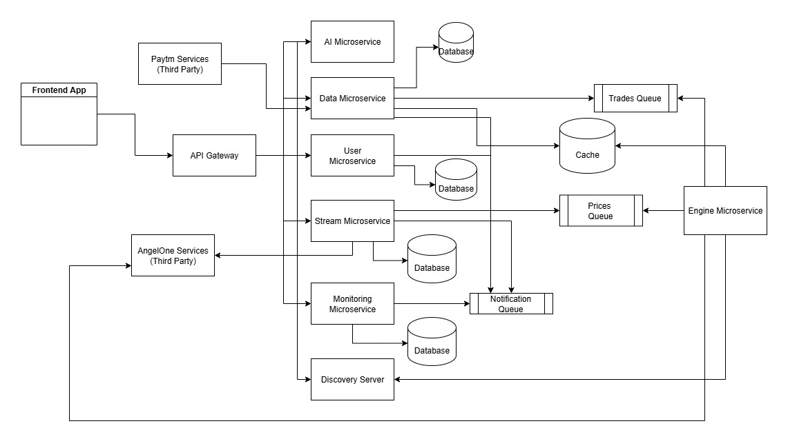

# AetherEdge – Portfolio Management & Algo Trading Platform for Retail Traders

AetherEdge is a self-hosted, microservices-based portfolio and algorithmic trading platform built to empower retail traders with professional-grade tools and insights.

Confidence in trading comes from data, and AetherEdge puts that at the core. The platform integrates with multiple third-party market data providers to deliver actionable insights, enabling smarter, faster, and more disciplined trading decisions.

Whether you're managing a portfolio or building custom trading strategies, AetherEdge provides a robust foundation for trading the markets with clarity and confidence.

---

### Architecture

Below is the high-level architecture of the AetherEdge Platform. It follows a fully decoupled **microservices architecture** for scalability, flexibility, and maintainability.

---

### Technology Stack

**Frontend:** JavaScript, ReactJS, Tailwind CSS  
**Backend:** Java, Spring Boot, Spring Cloud, Spring Security  
**Databases:** PostgreSQL, MongoDB  
**Cache:** Redis  
**Messaging Queue:** Kafka  
**Microservices Components:** API Gateway, Discovery Server, Feign Clients

---

### Features

#### Market Overview
Understand market trends and sentiment at a macro and sector level.

- **Global Panorama** – View high-level market trends and indices across global exchanges.
- **Sector Panorama** – Analyze sector-wise performance and capital flow.
- **News Radar** – Track market-moving news and headlines in real-time.

#### Portfolio Management
Manage and analyze your portfolio performance and get insights.

- **Portfolio Overview** – Summary view of all holdings, performance, and allocation.
- **Portfolio Analyzer** – Analyze risk, returns, and diversification metrics.
- **Portfolio Advisor** – AI-driven suggestions for optimizing your portfolio.

#### Derivatives Analysis
Advanced tools for understanding derivatives and options data.

- **Chain Intelligence** – Visualize and interpret option chain data effectively.
- **Option Genome** – Deep analysis of options to find unusual activities and signals.
- **Derivatives Lab** – Experiment with custom derivative strategies and analytics.

#### Algorithmic Trading
Design, backtest, and manage automated trading strategies.

- **Strategy Management** – Create, modify, and organize algo trading strategies.
- **Strategy Monitoring** – Monitor live performance and execution of active strategies.
- **Backtesting Engine** – Simulate strategies on historical data to validate performance.

#### Trading & Execution
Direct interface for placing trades and managing executions.

- **Trading Desk** – Unified interface for manual and semi-automated trade execution.
- **Trading Alerts** – Real-time alerts for signals, market triggers, and strategy events.

#### Settings & System Tools
Control platform behavior and monitor infrastructure health.

- **Application Settings** – Manage core configurations of the trading platform.
- **Health Monitoring** – Monitor microservice health, uptime, and performance metrics.
- **System Logging** – View system logs for debugging, audit, and system tracing.

---

## Installation

AetherEdge is designed to be **self-hosted** on any cloud infrastructure using **Docker Compose**, allowing for easy deployment and quick setup.

To get started, you'll need:

- A cloud VM or local machine with Docker and Docker Compose installed.
- Valid API keys from **AngelOne** and **Paytm Money**.

> **Note:**  
> Since this is not an open-source project, installation scripts and Docker configurations are not publicly available.

If you're interested in using the platform or need a deployment setup, feel free to **contact me directly** for access and guidance.
